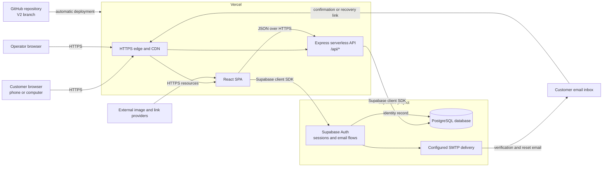
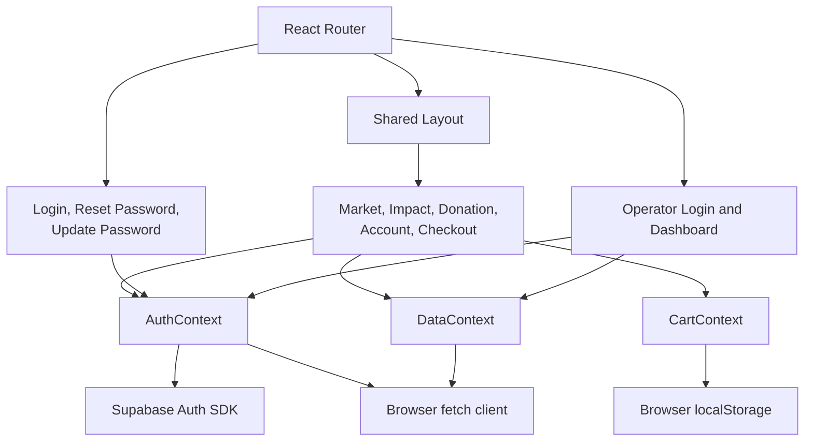
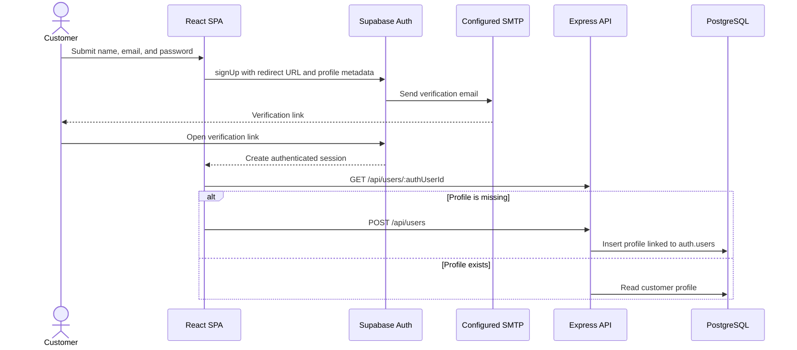
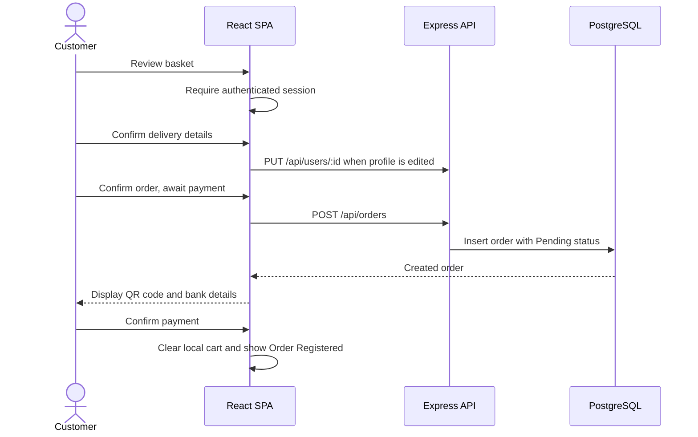
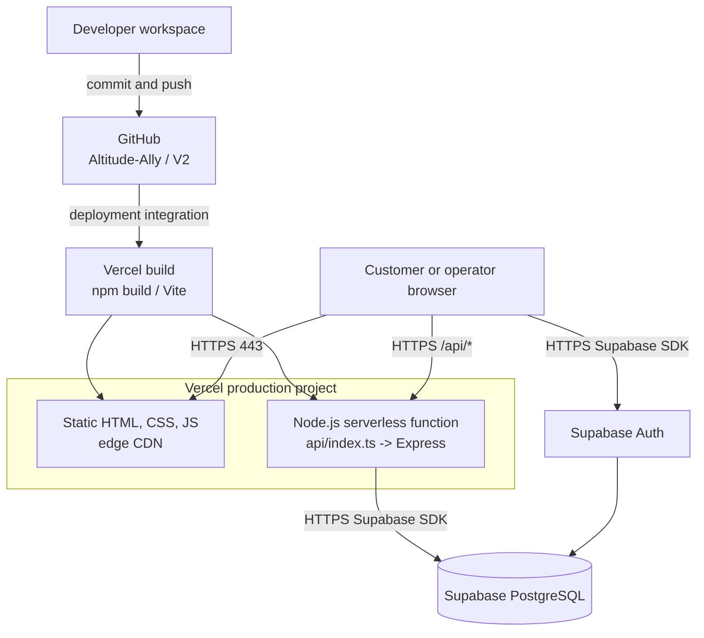
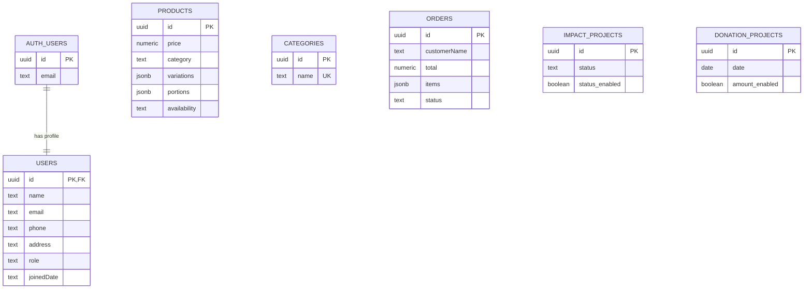

# Altitude Ally Architecture Design Document

| Document field | Value |
| --- | --- |
| System | Altitude Ally Web Platform |
| Document version | 1.0 |
| Architecture status | Current-state baseline with recommended production target |
| Baseline date | 18 July 2026 |
| Source branch | `V2` |
| Primary deployment | Vercel |
| Data and identity platform | Supabase |

This document describes the architecture represented by the source code in this repository. It does not contain environment values, passwords, private keys, or other deployment secrets.

## 1. Introduction

### 1.1 Purpose

This document provides a comprehensive architectural overview of Altitude Ally. It uses system context, logical, data, deployment, and security views to explain how the application is structured and how its parts interact.

The document is intended to:

- Establish a shared technical baseline for developers, operators, and project stakeholders.
- Record the significant architectural decisions already made in the project.
- Clarify which capabilities are implemented and which are external or planned.
- Identify current constraints and the work required before handling production-sensitive customer and payment data at larger scale.
- Guide future changes without losing consistency across the storefront, administration console, API, and database.

### 1.2 Scope

Altitude Ally is a responsive web platform that connects customers with products from mountain communities and communicates the organization's impact and donation work. It solves four related business problems:

1. Customers need a clear mobile and desktop storefront for discovering products, selecting variations and portions, and placing an order.
2. Registered customers need verified accounts, saved contact details, password recovery, and a consistent checkout flow.
3. Operators need one place to manage products, categories, orders, members, payment instructions, impact projects, donation projects, and editable page content.
4. The organization needs an automatically deployed website backed by a shared cloud database so changes are visible without manual file distribution.

The scope covered by this document includes:

- Public market, impact, donation, account, checkout, and footer content experiences.
- Customer registration, email verification, login, logout, and password reset.
- Product options, cart persistence, order creation, and manual QR-code payment instructions.
- Operator inventory, order, community, impact, donation, payment, page configuration, and credential screens.
- The React frontend, Express API, Supabase Auth and PostgreSQL database, Vercel deployment, and GitHub delivery flow.

The current system does not include an automated card/payment gateway, payment webhook verification, delivery-provider integration, warehouse integration, message queue, application cache, native mobile app, or dedicated reporting warehouse.

### 1.3 Definitions, Acronyms, and Abbreviations

| Term / Acronym | Definition |
| --- | --- |
| API | Application Programming Interface. The `/api` HTTP endpoints used by the web client. |
| ADR | Architecture Decision Record. A short record of an important technical choice and its tradeoffs. |
| CDN | Content Delivery Network used to deliver frontend assets close to users. |
| CI/CD | Continuous Integration and Continuous Deployment. |
| CORS | Cross-Origin Resource Sharing, which controls browser access to an API from other origins. |
| CRUD | Create, Read, Update, and Delete operations. |
| JWT | JSON Web Token used by Supabase Auth to represent an authenticated session. |
| LCP | Largest Contentful Paint, a user-perceived page-loading performance metric. |
| PII | Personally Identifiable Information such as names, email addresses, phone numbers, and addresses. |
| RBAC | Role-Based Access Control. |
| RLS | PostgreSQL Row Level Security, used by Supabase to restrict data access by identity and role. |
| SPA | Single-Page Application. The browser loads one application shell and changes views client-side. |
| SMTP | Simple Mail Transfer Protocol used to deliver account verification and password-reset emails. |
| TLS | Transport Layer Security used by HTTPS to encrypt data in transit. |
| UI / UX | User Interface / User Experience. |
| Vite | Frontend build and local development tool. |

## 2. Architectural Representation and Overview

### 2.1 Architecture Style

Altitude Ally currently uses a managed, three-tier web architecture:

- **Presentation tier:** A client-rendered React SPA organized by route and shared React contexts.
- **Application tier:** A single stateless Express application exposed as a Vercel serverless function.
- **Data and identity tier:** Supabase Auth and a Supabase-hosted PostgreSQL database.

Within the repository, the system is a modular monolith rather than a microservice system. This is appropriate for the current product size because it keeps deployment and development simple. Vercel and Supabase provide managed scaling at their respective boundaries.

### 2.2 Technical Stack

| Layer | Technology | Role |
| --- | --- | --- |
| Frontend | React 19, TypeScript 5.8 | Component-based user interface and client logic. |
| Routing | React Router 7 | Client-side page routing and navigation. |
| Build tooling | Vite 6 | Development server, bundling, and production asset generation. |
| Styling | Tailwind CSS 4 | Responsive layout, design tokens, and component styling. |
| Motion and icons | Motion 12, Lucide React | Transitions, dialogs, and iconography. |
| Client state | React Context and browser `localStorage` | Authentication view state, shared server data, and persistent cart state. |
| Backend | Node.js with Express 4 | JSON HTTP API and Supabase database access. |
| Database | Supabase PostgreSQL | Transactional product, order, profile, project, and configuration data. |
| Authentication | Supabase Auth | Email/password identity, JWT sessions, email verification, and password recovery. |
| Transactional email | Supabase Auth plus configured SMTP provider | Verification and password-reset email delivery. SMTP configuration is external to this repository. |
| Hosting | Vercel | Static SPA hosting, CDN delivery, rewrites, and serverless API execution. |
| Source control | GitHub | Version control and deployment source using the `V2` branch. |
| Cache | None | No application cache is currently configured. |
| Message queue | None | All current workflows are synchronous. |
| Media storage | Database text fields and external URLs | Images are stored as URLs or browser-generated data URLs; there is no dedicated object-storage integration yet. |

The `@google/genai` package and a Gemini build-time setting are present but are not used by the current application. AI is therefore not an active architectural subsystem.

### 2.3 High-Level System Architecture

Vercel rewrites `/api/*` to the serverless entry point and rewrites every other route to `index.html`, allowing React Router to handle deep links such as `/impact` and `/account`.

### 2.4 Architectural Containers

| Container | Responsibility | Primary source |
| --- | --- | --- |
| React SPA | Renders all customer and operator experiences and manages route-level interaction. | `src/` |
| Auth context | Maintains the Supabase session, customer profile, verification, and password recovery actions. It also currently loads operator credentials. | `src/lib/AuthContext.tsx` |
| Data context | Loads shared API data and exposes frontend CRUD actions for products, orders, projects, and page configuration. | `src/lib/DataContext.tsx` |
| Cart context | Stores selected product-option combinations and quantities in browser local storage. | `src/lib/CartContext.tsx` |
| Express API | Implements database-facing routes for products, orders, users, projects, and configuration. | `server/index.ts` |
| Vercel function adapter | Exports the Express app as the Vercel API entry point. | `api/index.ts` |
| PostgreSQL schema | Defines application tables and the incremental V2 migration. | `supabase/schema.sql`, `supabase/v2-migration.sql` |

## 3. Architectural Goals and Constraints

### 3.1 Goals

| Goal | Architectural response |
| --- | --- |
| Responsive usability | One React application uses responsive Tailwind layouts for phone and computer experiences. |
| Simple content administration | Products, projects, payment details, and page text are data-driven and editable through the operator console. |
| Shared cloud data | The API reads and writes one Supabase PostgreSQL database, giving all deployed clients a consistent data source. |
| Verified customer identity | Customer identity uses Supabase email/password authentication with confirmation and password-recovery flows. |
| Fast delivery of changes | GitHub changes on the deployment branch trigger an automatic Vercel build and deployment. |
| Low operational overhead | Vercel and Supabase provide managed hosting, TLS, scaling primitives, and platform monitoring. |
| Evolvability | Page modules, contexts, API resources, and configuration tables provide clear places for future features. |

### 3.2 Current Constraints

- The backend is a single serverless Express application. Long-running jobs and durable background work are not supported by the current design.
- The UI initially requests all products, categories, orders, users, projects, and page configuration. This will need pagination and role-aware loading as data volume grows.
- Cart contents are device-local. They do not synchronize between browsers or devices.
- Payment is manual. The system displays a QR code but does not receive bank or payment-gateway confirmation.
- Product, impact, donation, and QR images are text values in PostgreSQL. Uploaded files are converted to data URLs, increasing row and API payload size.
- Orders store item descriptions in JSON rather than normalized order and order-item records.
- Customer account order history is only added to in-memory profile state after checkout and is not reloaded from the `orders` table after a refresh or new session.
- The database schema does not currently establish a user foreign key on orders or a category foreign key on products.
- No cache, queue, background worker, search service, or analytics warehouse is configured.
- Node.js and package-manager runtime versions are not pinned in the repository.

### 3.3 Non-Functional Requirements and Service Objectives

The repository does not currently define contractual service-level objectives or validated load limits. The following targets are recommended and must be confirmed by the business before production launch.

| Quality | Current state | Recommended target |
| --- | --- | --- |
| Scalability | Stateless API and managed platforms can scale, but startup reads are unpaginated and no load test exists. | Define an expected concurrency level, load-test it, paginate list APIs, and keep the API stateless. |
| Availability | Availability depends on Vercel and Supabase. No application-managed failover exists. | 99.9% monthly availability if required by the business, supported by provider plans, backups, and a tested recovery process. |
| Reliability | Database writes are synchronous. There is no retry queue or idempotency key for order submission. | Idempotent order creation, explicit timeouts, bounded retries for safe reads, and documented recovery behavior. |
| Security | Production traffic uses HTTPS and customer identity uses Supabase Auth. API authorization and operator security require hardening. | TLS 1.2+, Supabase-managed encryption at rest, verified JWTs, RBAC, RLS, least privilege, hashed credentials, and audit logging. |
| API performance | No percentile measurements exist. Initial page load starts 11 API calls concurrently. | p95 under 500 ms for standard API reads from the primary user region, then refine using real measurements. |
| Frontend performance | Production assets are bundled by Vite; the main bundle currently triggers a large-chunk warning. | LCP under 2.5 seconds at the 75th percentile and route-level code splitting for heavy screens. |
| Accessibility | Semantic labels and responsive touch controls exist in key flows, but no automated audit is configured. | WCAG 2.2 AA for customer workflows, verified with automated and manual testing. |
| Data recovery | Supabase backup settings are external to the repository and no restore procedure is documented. | Define recovery point and recovery time objectives and perform scheduled restore tests. |

## 4. Detailed Design and Logical View

### 4.1 Subsystems and Module Breakdown

| Module | Responsibilities |
| --- | --- |
| Application shell and navigation | Defines public and operator routes, shared header/footer, cart access, responsive navigation, and footer dialogs. |
| Market and catalog | Loads visible products and categories, supports search/filtering, opens product details, selects variations/portions, and handles stock visibility. |
| Cart | Builds a unique cart-line identity from product plus selected options, changes quantities, calculates totals, and persists cart state locally. |
| Customer authentication | Registers users, requests email confirmation, signs users in/out, restores Supabase sessions, resends confirmation, and handles reset/update password flows. |
| Customer profile | Creates or loads a profile linked to `auth.users`, and edits name, phone, and address details. |
| Checkout and orders | Presents basket, confirms delivery information, creates a pending order, displays QR payment instructions, and shows a persistent confirmation view. |
| Impact | Displays configurable page content, a horizontal project gallery, optional project status, project details, and a configurable full-width showcase image. |
| Donation | Displays configurable introductory content, donation projects, optional amounts, external organization link, and direct-donation QR image. |
| Footer content | Displays mission, privacy, terms, and contact information in on-page dialogs backed by page configuration. |
| Operator console | Manages products, stock state, categories, orders, members, impact projects, donation projects, payment settings, page configuration, and operator credentials. |
| Shared data access | Loads API resources into React state and applies successful CRUD responses to the UI. |
| API application | Maps HTTP resources to Supabase database operations and provides default page configuration when selected records are absent. |

### 4.2 Frontend Logical View

Provider order is `AuthProvider` -> `DataProvider` -> `CartProvider` -> `BrowserRouter`. The data provider currently loads its full data set for customer pages and the operator dashboard alike.

### 4.3 Primary Data Flows

#### Application startup

1. Vercel returns `index.html` and versioned frontend assets.
2. `AuthContext` restores any Supabase Auth session and loads the related profile through `/api/users/:id`.
3. `DataContext` starts parallel API reads for products, categories, orders, users, projects, payment settings, and page configuration.
4. `CartContext` restores the cart from browser `localStorage`.
5. React Router renders the requested page.

The all-data startup request is a current-state design, not the desired production authorization model. Customer pages should not receive all user and order records.

#### Customer registration and email verification

Password recovery uses `resetPasswordForEmail`, redirects the customer to `/update-password`, validates the recovery session, and updates the password through Supabase Auth.

#### Product selection and cart

1. The market page excludes products with `availability = hidden`.
2. Selecting a product opens a detailed dialog with description, details, variations, and portions.
3. A cart line ID combines the product ID and selected option values.
4. The customer adds or adjusts quantity with minus and plus controls.
5. Cart state and computed totals are written to browser `localStorage`.

#### Checkout and manual payment

`Confirm payment` is currently a customer acknowledgement only. It does not verify that funds were received, and it does not change the order status. An operator updates order status later.

#### Operator content update

1. The operator opens a management dialog and edits a resource.
2. The related data-context action sends `POST`, `PUT`, or `DELETE` to the Express API.
3. The API performs the corresponding Supabase table operation.
4. The API returns the stored row and the React context updates local state.

### 4.4 HTTP API Surface

All routes are implemented in `server/index.ts` and are exposed beneath `/api`.

| Resource | Read routes | Write routes | Current consumer |
| --- | --- | --- | --- |
| Products | `GET /products` | `POST /products`, `PUT /products/:id`, `DELETE /products/:id` | Market and operator inventory. |
| Orders | `GET /orders` | `POST /orders`, `PUT /orders/:id` | Checkout and operator tracking. |
| Categories | `GET /categories` | `POST /categories`, `DELETE /categories/:name` | Market filters and operator management. |
| Users | `GET /users`, `GET /users/:id` | `POST /users`, `PUT /users/:id` | Customer profiles and operator member list. |
| Impact projects | `GET /impact/projects` | `POST`, `PUT /impact/projects/:id`, `DELETE /impact/projects/:id` | Impact page and operator management. |
| Donation projects | `GET /donation/projects` | `POST`, `PUT /donation/projects/:id`, `DELETE /donation/projects/:id` | Donation page and operator management. |
| Payment configuration | `GET /payment/config` | `PUT /payment/config` | Checkout and operator payment setup. |
| Impact page configuration | `GET /impact/page_config` | `PUT /impact/page_config` | Impact page and page configuration. |
| Donation page configuration | `GET /donation/page_config` | `PUT /donation/page_config` | Donation page and page configuration. |
| Market page configuration | `GET /market/page_config` | `PUT /market/page_config` | Market hero and page configuration. |
| Footer page configuration | `GET /footer/page_config` | `PUT /footer/page_config` | Shared footer dialogs and page configuration. |
| Operator configuration | `GET /admin/config` | `PUT /admin/config` | Operator login and credential screen. |

Routes for `fund_stats` and `impact_metrics` remain in the API, but the current UI does not call them and the checked-in schema does not provision those tables. They should be removed or restored through an explicit migration rather than treated as active capabilities.

### 4.5 State and Data Ownership

| State | System of record | Client behavior |
| --- | --- | --- |
| Customer identity and password | Supabase Auth | Session is restored and refreshed by the Supabase browser client. |
| Customer profile | `public.users` | Loaded after authentication and updated through the API. |
| Products and categories | PostgreSQL | Loaded into `DataContext` and updated optimistically after successful API responses. |
| Orders | PostgreSQL | The operator list is database-backed. Customer account history is currently session-only because it is not queried back from the orders table. |
| Cart | Browser `localStorage` | Survives reloads on the same browser only. |
| Checkout step | React component memory | Resets when the page is reloaded. |
| Page content and payment instructions | Singleton PostgreSQL configuration rows | Loaded by `DataContext` and edited by the operator. |
| Operator login | Database configuration plus React component comparison | No secure server session is currently established. |
| Media | URL or data URL stored in a text column | Rendered directly by the browser. |

### 4.6 Error Handling

- API handlers return JSON errors with HTTP 500 for Supabase failures, 404 for selected missing singleton/profile records, 201 after creation, and 204 after deletion.
- `DataContext` logs initial-load failures and continues rendering with empty or default state.
- Checkout catches order-creation failure and keeps the customer on the confirmation step.
- Several write actions currently do not surface a user-facing error when the API fails.
- There is no shared error schema, request correlation ID, centralized exception middleware, or automatic retry policy.

## 5. Deployment and Physical View

### 5.1 Deployment Topology

The repository does not define containers, Kubernetes, a private VPC, a dedicated load balancer, or multi-availability-zone application nodes. Vercel and Supabase are managed SaaS boundaries and implement their own internal infrastructure according to the selected plans.

### 5.2 Vercel Routing

`vercel.json` defines two rewrites:

1. `/api/(.*)` routes to `/api/index.ts`, which exports the Express application.
2. Every other path routes to `/index.html`, enabling SPA deep-link behavior.

The Express app calls `listen` only outside production. In Vercel, the platform invokes the exported application for each serverless request.

### 5.3 Local Development Topology

`npm run dev` starts two processes:

- Vite on port `3000` for the frontend.
- Express through `tsx` on port `3001` for the backend.

Vite proxies local `/api` calls to port `3001`, preserving the same browser-facing API paths used in production.

### 5.4 Environment Configuration

| Variable | Runtime | Purpose | Handling |
| --- | --- | --- | --- |
| `VITE_SUPABASE_URL` | Browser build | Supabase project URL. | Included in the frontend bundle by design. |
| `VITE_SUPABASE_ANON_KEY` | Browser build | Supabase public/anonymous client key. | Public by design; security must be enforced with RLS and policies. |
| `SUPABASE_URL` | Server | Supabase project URL for API calls. | Configure in Vercel and local environment. |
| `SUPABASE_PUBLISHABLE_KEY` or `SUPABASE_ANON_KEY` | Server | Supabase API credential used by Express. | Do not commit values; current key class does not bypass RLS. |
| `PORT` | Local server | Express listening port, default `3001`. | Local/runtime setting. |
| `NODE_ENV` | Server | Prevents `app.listen` in production. | Set by the hosting platform. |
| `GEMINI_API_KEY` | Vite build configuration | Present in build configuration but unused. | Remove unless an approved server-side AI integration is added; never expose a private AI key in client code. |

`.env*` files are ignored by Git except `.env.example`. Secrets must be stored in Vercel project settings, Supabase settings, and approved local secret stores, never in GitHub.

### 5.5 Delivery Pipeline

Current delivery flow:

1. Changes are committed to the GitHub `V2` branch.
2. Vercel detects the branch update.
3. Vercel installs dependencies and runs the Vite production build.
4. Static assets and the serverless API are deployed together.
5. The production domain serves the new deployment after Vercel promotes it.

No GitHub Actions workflow is checked into the repository. Recommended deployment gates are TypeScript type-checking, production build, unit tests, API integration tests, and a small end-to-end smoke test before production promotion.

### 5.6 Network and Security Infrastructure

- Public users connect to Vercel on HTTPS port 443. HTTP-to-HTTPS redirection and TLS termination are platform-managed.
- Vercel and the browser connect to Supabase through public HTTPS endpoints.
- There is no repository-managed firewall, security group, private subnet, or VPC peering configuration.
- Express currently enables unrestricted CORS. Same-origin production traffic does not require this broad policy, so allowed origins should be restricted.
- Supabase database access currently uses a publishable/anonymous key. This key is not a secret and must be paired with RLS and explicit policies.
- SMTP sender, redirect URL, and email template settings are managed in Supabase and the selected mail provider, outside this repository.

## 6. Data View

### 6.1 Database Engine

The database is PostgreSQL hosted by Supabase. UUID primary keys use the `uuid-ossp` extension. Most domain tables include a UTC `created_at` timestamp. Configuration tables use a fixed integer key, normally `id = 1`, to represent one active site configuration.

### 6.2 Table Summary

| Table | Important fields | Purpose |
| --- | --- | --- |
| `auth.users` | Supabase-managed identity fields | Source of truth for customer authentication and email confirmation. |
| `public.users` | `id`, `name`, `email`, `phone`, `address`, `role`, `joinedDate` | Customer profile linked one-to-one to `auth.users`. |
| `products` | `name`, `price`, `unit`, `category`, `description`, `details`, `variations`, `portions`, `availability`, `image` | Product catalog and selectable options. |
| `categories` | `name` | Unique market filter values managed by operators. |
| `orders` | `customerName`, `date`, `total`, `items`, `status` | Pending and fulfilled customer orders. Items are stored as a JSON array of display strings. |
| `impact_projects` | `title`, `amount`, `status`, `status_enabled`, `image`, `details` | Impact gallery and project detail content. |
| `donation_projects` | `title`, `date`, `image`, `description`, `amount`, `amount_enabled` | Donation gallery and optional amount content. |
| `payment_config` | `qr_image`, `bank_info` | Singleton QR payment instructions used during checkout. |
| `impact_page_config` | `hero_title`, `hero_description`, `showcase_title`, `showcase_image`, legacy transparency fields | Singleton impact-page content. |
| `donation_page_config` | `title`, `subtitle`, `bottom_title`, external-link fields, `qr_image`, `qr_caption` | Singleton donation-page content. |
| `market_page_config` | `hero_image_url` | Singleton market hero image. |
| `footer_page_config` | mission, privacy, terms, Instagram, email, LINE, Facebook fields | Singleton footer dialog and contact content. |
| `admin_config` | `username`, `password` | Current operator credential configuration. This design must be replaced before production hardening. |

### 6.3 Relationship View

The only enforced foreign-key relationship in the checked-in schema is `public.users.id -> auth.users.id`, with profile deletion cascading when an Auth user is deleted. Products refer to categories by text, and orders do not contain a customer/user foreign key.

### 6.4 Data Design Characteristics

- `variations` and `portions` are JSON arrays to support flexible operator-defined options without separate option tables.
- `orders.items` is JSON and optimized for simple display, not detailed fulfillment reporting or historical product snapshots.
- Product availability is constrained to `visible`, `out_of_stock`, or `hidden` in the bootstrap schema.
- Impact status is modeled as text in PostgreSQL and as `Active`, `Wait`, or `Done` in TypeScript.
- Optional display values use companion booleans such as `status_enabled` and `amount_enabled`.
- Profile phone country code and subscriber number are combined before persistence in one `phone` text field.
- Media may be a remote URL or a potentially large base64 data URL stored directly in a text field.
- Page configuration tables are singleton records and are updated with upsert operations.

### 6.5 Retention, Backup, and Privacy

No retention or archival policy is encoded in the repository. Before production use, the project should define:

- How long customer profiles, addresses, phone numbers, and order records are retained.
- A customer-account deletion and data-export process.
- Order retention required for operational, tax, and accounting purposes, confirmed through applicable legal review.
- Platform-log retention and access controls.
- Supabase backup frequency, recovery point objective, recovery time objective, and restore testing.
- A process for removing orphaned media when object storage is introduced.

PII must not be written to public logs, client analytics, source control, or unrestricted API responses.

### 6.6 Schema Change Management

- `supabase/schema.sql` represents the bootstrap schema for a new project.
- `supabase/v2-migration.sql` contains idempotent additions for the V2 product details, donation, impact showcase, market, and footer features.
- Migrations are currently SQL files and are not automatically applied by the Vercel deployment.

Future schema changes should use ordered, immutable migration files applied through a controlled Supabase migration process. Deployment should verify that the database version is compatible before new application code is promoted.

## 7. Key Architectural Decisions

| ADR | Decision | Reason | Tradeoff / consequence | Status |
| --- | --- | --- | --- | --- |
| ADR-001 | Use a React SPA with React Router. | Supports one responsive experience and quick client navigation across the market, content, account, and operator pages. | Initial JavaScript bundle is larger and SEO/server rendering is limited. | Accepted |
| ADR-002 | Use Vite and TypeScript. | Provides fast local feedback, production bundling, and compile-time checks with low configuration overhead. | Build-time environment values prefixed with `VITE_` are public in the browser bundle. | Accepted |
| ADR-003 | Use one Express API as a Vercel serverless function. | Keeps the backend simple and deploys frontend and API from one repository. | All resources share one deployment and security boundary; long-running work is unsuitable. | Accepted |
| ADR-004 | Use Supabase for PostgreSQL and customer Auth. | Reduces infrastructure work and provides email verification, password recovery, and managed data APIs. | The system depends on Supabase availability and correct RLS/auth configuration. | Accepted |
| ADR-005 | Use React Context for shared state. | The application is small enough to avoid a heavier state library and has clear auth, data, and cart domains. | Full-context updates and broad initial data loading will become inefficient at larger scale. | Accepted |
| ADR-006 | Persist the cart in browser local storage. | Provides a free, simple cart that survives refresh without requiring login or a server table. | The cart is device-specific, user-editable, and unavailable across devices. | Accepted |
| ADR-007 | Model product options and order items with JSON. | Allows flexible operator-entered variations and portions with a simple schema. | Reporting, validation, pricing per option, and referential integrity are limited. | Accepted for current scope |
| ADR-008 | Store editable site copy and images in configuration tables. | Operators can change content without a code deployment. | Singleton tables and inline image data need validation, access control, and eventually object storage. | Accepted |
| ADR-009 | Use a manual QR payment flow. | Matches the current operating process without payment-gateway fees or integration complexity. | Payment is not verified automatically and requires operator reconciliation. | Accepted for pilot; review before scale |
| ADR-010 | Deploy the GitHub `V2` branch automatically through Vercel. | Gives the project a separate second-version history and rapid feedback after changes. | Production changes need stronger test and approval gates as usage grows. | Accepted |
| ADR-011 | Separate impact projects and donation projects. | The two content types have different fields and business meaning. | The operator console must maintain two management forms and page configurations. | Accepted |

## 8. Security Architecture and Required Hardening

### 8.1 Trust Boundaries

The browser is an untrusted environment. UI route guards, hidden buttons, client-side credential comparisons, and public Supabase keys cannot authorize privileged actions. Authorization must be enforced by the API and database for every request.

Customer authentication already delegates password storage and JWT session handling to Supabase Auth. However, the Express API does not currently validate the customer's access token, and operator access uses credentials returned to and compared in the browser.

### 8.2 Current High-Risk Gaps

1. Operator credentials are stored in plaintext and can be returned by a public API route.
2. `/operator/dashboard` has no server-verified operator session and can be opened directly by route.
3. API read and write routes do not verify JWTs or roles.
4. User, order, payment, and operator configuration reads are included in the shared application startup request.
5. No RLS policies are included in the checked-in schema.
6. CORS is unrestricted and request payloads are not validated against explicit schemas.
7. Order totals are accepted from the browser rather than recalculated from trusted product records.
8. Payment confirmation is not verified against a bank or gateway.

The current architecture should be treated as a development or controlled pilot architecture until these items are addressed.

### 8.3 Production Security Target

Recommended implementation order:

1. Replace `admin_config` password login with Supabase Auth operator accounts and a server-verifiable operator role or custom claim.
2. Require and validate Supabase JWTs in Express. Apply resource-level RBAC so only operators can manage products, orders, members, projects, payment, and page configuration.
3. Enable RLS on every public table. Allow public reads only for safe catalog/content fields, profile access only to the profile owner, and operator access only to authorized users.
4. Remove public endpoints that return all users, all orders, payment internals, or operator configuration to ordinary customers.
5. Validate and size-limit every request. Recalculate order prices server-side and add idempotency protection.
6. Restrict CORS to approved production and preview origins and add rate limiting to authentication-adjacent and write endpoints.
7. Move uploaded media to Supabase Storage or another object store with file-type, size, and access policies.
8. Add audit records for operator changes and security-sensitive events.
9. Rotate any credentials used by the current operator mechanism after it is removed.
10. Add automated dependency, secret, and authorization tests to the delivery pipeline.

## 9. Performance, Reliability, and Operations

### 9.1 Performance

Current strengths:

- Static frontend files are CDN-delivered and content-hashed.
- Data requests are started concurrently.
- The API is stateless and uses Supabase's HTTP client rather than maintaining local database connections.
- Product and project grids use responsive images and lazy visual interaction patterns.

Current scaling limits:

- All shared resources are loaded at application startup, including operator-only data.
- List endpoints return unbounded result sets.
- Images stored as data URLs can make database rows and JSON responses very large.
- The frontend ships a large shared bundle and does not use route-level lazy loading.
- Search and filtering run entirely in the browser over the loaded data set.

Recommended improvements are role-aware endpoint loading, pagination, server-side filtering, object storage with optimized image variants, route-level code splitting, and performance monitoring before introducing a cache.

### 9.2 Reliability

- Add an order idempotency key to prevent duplicate orders after retries or double submissions.
- Validate database responses before updating client state.
- Use a shared API error format and centralized Express error middleware.
- Add health/readiness checks that verify required configuration without exposing secret values.
- Define behavior when Supabase, SMTP, or external image providers are unavailable.
- Document and test backup restoration and rollback procedures.

### 9.3 Observability

The current implementation uses browser and server console logging plus Vercel/Supabase platform logs. There is no structured logging, tracing, application-performance monitoring, or alert definition in the repository.

Recommended minimum telemetry:

- Structured server logs with request ID, route, status, duration, and sanitized error code.
- Vercel alerts for serverless error rate and latency.
- Supabase alerts for database health, authentication failures, and resource limits.
- Client error monitoring without recording passwords, tokens, addresses, phone numbers, or full order content.
- Business metrics for order creation, payment-awaiting duration, order completion, and email-verification success.

### 9.4 Testing Strategy

The repository currently provides TypeScript checking through `npm run lint` and production compilation through `npm run build`; no automated test suite is checked in.

Recommended layers:

| Test layer | Coverage target |
| --- | --- |
| Unit | Cart-line identity, totals, status formatting, phone parsing, and data transformations. |
| Component | Product options, login/signup validation, page-config forms, and status controls. |
| API integration | Authentication, authorization, payload validation, CRUD behavior, and database constraints. |
| End-to-end | Signup verification, password reset, product selection, checkout, operator order update, and content publication. |
| Security | Direct-route access, horizontal profile access, operator-only writes, RLS policies, and order-total tampering. |
| Visual/responsive | Key customer and operator screens at phone, tablet, and desktop widths. |

## 10. Recommended Evolution Roadmap

### Phase 1: Protect current data

- Implement Supabase-backed operator identity, JWT verification, RBAC, and RLS.
- Split public bootstrap data from operator-only data.
- Remove plaintext operator credentials and rotate them.
- Add server-side validation and trusted order-price calculation.

### Phase 2: Improve data integrity

- Add `orders.user_id`, delivery-contact snapshots, a payment state, and normalized `order_items`.
- Link products to category IDs or enforce category values through a controlled reference.
- Add explicit database checks/enums for order and impact status.
- Add immutable migration ordering and a repeatable deployment process.

### Phase 3: Improve media and payment operations

- Move media to object storage with resized variants and lifecycle rules.
- Add proof-of-payment upload or a payment provider with signed webhook verification.
- Separate order status from payment status.
- Add operator audit history and reconciliation views.

### Phase 4: Scale and monitor

- Add pagination, route-level loading, code splitting, and measured performance budgets.
- Add automated CI checks, end-to-end smoke tests, monitoring, and alerts.
- Define service, backup, retention, and incident-response objectives.

## 11. Source Code Map

| Area | Path |
| --- | --- |
| Route composition | `src/App.tsx` |
| Shared navigation and footer | `src/components/Layout.tsx` |
| Customer authentication and profiles | `src/lib/AuthContext.tsx` |
| Shared server data and CRUD actions | `src/lib/DataContext.tsx` |
| Cart state | `src/lib/CartContext.tsx` |
| Supabase browser client | `src/lib/supabase.ts` |
| Market and product details | `src/pages/MarketPage.tsx` |
| Checkout and payment confirmation | `src/pages/CheckoutPage.tsx` |
| Account management | `src/pages/AccountPage.tsx` |
| Impact and donation experiences | `src/pages/ImpactPage.tsx`, `src/pages/DonationPage.tsx` |
| Customer login and recovery | `src/pages/CustomerLoginPage.tsx`, `src/pages/ResetPasswordPage.tsx`, `src/pages/UpdatePasswordPage.tsx` |
| Operator access and management | `src/pages/OperatorLoginPage.tsx`, `src/pages/OperatorDashboard.tsx` |
| API implementation | `server/index.ts` |
| Vercel API adapter | `api/index.ts` |
| Deployment rewrites | `vercel.json` |
| Database bootstrap and migration | `supabase/schema.sql`, `supabase/v2-migration.sql` |

## 12. Review and Maintenance

Update this document when any of the following changes occur:

- A new external service, payment provider, storage service, or deployment platform is introduced.
- Authentication, authorization, RLS, or operator access changes.
- A table, relationship, API resource, or major data-retention rule changes.
- A new customer or operator module is added.
- Deployment branch, environments, recovery objectives, or service-level objectives change.
- An ADR is replaced by a new decision.

Architecture review should be part of each major release. Security sections should be reviewed before any feature that expands access to PII, payment information, or operator capabilities.
